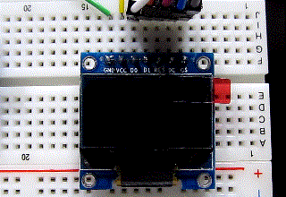

# mruby-esp32-spi-ssd1306

OLED SSD1306 (SPI) library for mruby-esp32.

This library is a for the SSD1306 based 128x64 pixel OLED display running on the mruby-esp32.


# Installation

Add the following line below to your `esp32_build_config.rb`:

```ruby
  conf.gem :github => 'icm7216/mruby-esp32-spi-ssd1306'
```

# Usage

Example of controlling the OLED display with SSD1306 controller.

### Demo movie




SPI Wiring
```
  SSD1306       NodeMCU-32S(ESP32)
      GND ----> GND
      VCC ----> 3v3 (3.3V)
       D0 ----> GPIO 18 SCK (SPI Clock) 
       D1 ----> GPIO 23 MOSI
      RES ----> GPIO 17 Reset
       DC ----> GPIO 16 Data/Command select
       CS ----> GPIO  5 Chip Select
```

The default setting is to use DMA Channel 1, VSPI host, SPI mode 0, and the SPI clock frequency of 10MHz. This setting is the same as the following initialization command.

Note: The clock speed is [Hz].
``` ruby
# default setting
oled = OLED::SSD1306SPI.new(sck: 18, mosi: 23, rst: 17, dc: 16, cs: 5, freq: 10000000, dma_ch: 1, spi_mode: 0)

# same as default
oled = OLED::SSD1306SPI.new()
```

In advance, you will need to add several mrbgems to `esp32_build_config.rb`
```ruby
  conf.gem :core => "mruby-math"
  conf.gem :core => "mruby-proc-ext"
  conf.gem :core => "mruby-toplevel-ext"
  conf.gem :github => "mruby-esp32/mruby-esp32-system"
```

### Note:

*   CS line is active-low signal. If assign another GPIO pin to use the second CS line, the initial setting of the second CS line must be HIGH level. This is important when connecting multiple devices to the same SPI bus.
*   GPIO2, GPIO4, and GPIO12 pins are pulled down with default settings after reset.  
See also: `4.10 IO_MUX Pad List` in the [ESP32 Technical Reference Manual](https://www.espressif.com/sites/default/files/documentation/esp32_technical_reference_manual_en.pdf)


In this case, the following command will help.
``` ruby
include ESP32

second_cs_line = 4
GPIO::pinMode(second_cs_line, GPIO::OUTPUT)
GPIO::digitalWrite(second_cs_line, GPIO::HIGH)

oled1 = OLED::SSD1306SPI.new()
oled2 = OLED::SSD1306SPI.new(cs: second_cs_line)
```

# Code
```ruby
include ESP32

oled = OLED::SSD1306SPI.new()
oled.clear

msg = ["Hello! mruby", "mruby-ESP32", "mruby", "ESP32"]
oled.fontsize = 1
oled.text(20, 0, msg[0])
oled.text(20, 12, msg[1])
oled.fontsize = 2
oled.text(20, 25, msg[0])
oled.text(20, 45, msg[1])
oled.display
System.delay(1000)
oled.clear

oled.rect(0, 0, 127, 63)
oled.vline(63, 10, 43)
oled.hline(32, 31, 60)
oled.circle(63, 31, 30)
oled.fill_circle(15, 31, 10)
oled.fill_rect(105, 21, 20, 20)
oled.display
System.delay(1000)
oled.color = OLED::INVERT
oled.fontsize = 3
oled.text(25, 5, msg[2])
oled.text(25, 36, msg[3])
oled.display
System.delay(2000)
oled.clear

oled.color = OLED::WHITE
x = 0
7.times do |n|
  fontsize = n + 1
  w = 8 * ((fontsize.div 2) + (fontsize & 0x01))
  x = x + 8 * (fontsize.div 2)
  oled.fontsize = fontsize
  oled.text(x, 0, fontsize.to_s)
end
oled.display
System.delay(1000)
oled.clear

# drawing Spirograph
rc = 15                           # Radius of the constant circle
rm = 9                            # Radius of the motion circle
rd = 8                            # Radius of the Drawing point
x_offset = 64
y_offset = 32

# trochoid functions
fx = ->(t){(rc + rm) * Math.cos(t) - rd * Math.cos(t * (rc + rm) / rm) + x_offset}
fy = ->(t){(rc + rm) * Math.sin(t) - rd * Math.sin(t * (rc + rm) / rm) + y_offset}

# greatest common divisor
def my_gcd(a, b)
  a, b = b, a % b while b > 0
  a
end

laps = rm / my_gcd(rc,rm)         # Number of laps
to = 2.0 * Math::PI * laps        # rotation angle
div = 0.1                         # angle
theta_end = (to + div).div div    # Drawing end angle

theta_end.times do |i|
  x0 = fx[div * i]
  y0 = fy[div * i]
  x1 = fx[div * (i + 1)]
  y1 = fy[div * (i + 1)]
  oled.line(x0, y0, x1, y1)
  oled.display
  GC.start
end
```


# Using library

**Many thanks!**

*   8x8 monochrome bitmap fonts from font8x8_basic.h by [dhepper/font8x8](https://github.com/dhepper/font8x8)
*   graphics libraries are adapted from OLEDDisplay.cpp by [squix78/esp8266-oled-ssd1306](https://github.com/squix78/esp8266-oled-ssd1306)


# License

MIT
